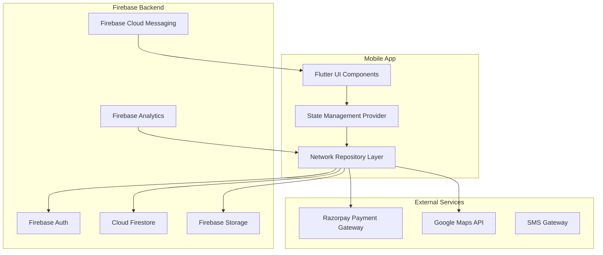
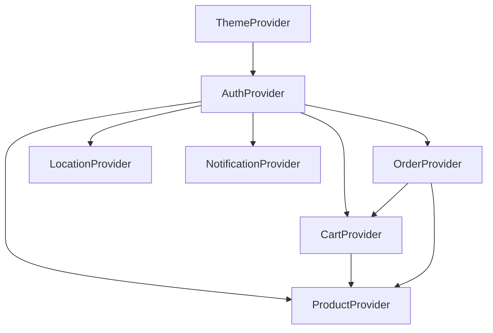
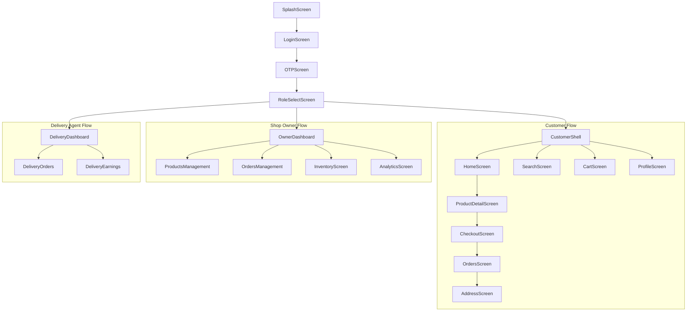

# Technical Design Document: Hyperlocal E-Commerce App

## Overview

The Hyperlocal Market app is a Flutter-based mobile application that connects local shop owners with customers within a specific district and surrounding villages. The app supports three primary user roles: Customers, Shop Owners, and Delivery Agents, with an Admin panel for platform management. The system leverages Firebase for backend services including authentication, database, storage, and cloud messaging.

### Core Features

The application provides a complete e-commerce ecosystem with product browsing, shopping cart management, checkout and order placement, order tracking, shop owner dashboard, delivery agent module, search and discovery, wishlist management, reviews and ratings, wallet and rewards system, notifications, location-based delivery area validation, offline support, and comprehensive analytics.

### Technology Stack

The frontend is built with Flutter, utilizing Provider for state management, GoRouter for navigation, and Firebase for backend services. The backend infrastructure relies entirely on Firebase services including Firebase Authentication for phone-based OTP verification, Cloud Firestore for the primary database, Firebase Storage for product images and user uploads, Firebase Cloud Messaging for push notifications, and Firebase Analytics/Crashlytics for monitoring.

## Architecture

### System Architecture Overview

### App Architecture Pattern

The application follows a clean architecture pattern with clear separation of concerns. The presentation layer contains UI components organized by feature and user role. The domain layer contains business logic and use cases. The data layer handles data sources, repositories, and Firebase integration. The provider layer manages state and serves as the bridge between UI and data layers.

### Layer Responsibilities

The presentation layer is responsible for rendering UI components, handling user interactions, and displaying data. The provider layer manages application state, implements business logic for UI updates, coordinates with repository layer, and handles caching and offline support. The data layer manages Firebase connections, implements repository interfaces, handles data transformation between models and DTOs, and manages local storage with Hive.

## Components and Interfaces

### Provider Hierarchy

The application uses a hierarchical provider structure with AuthProvider at the root level, followed by feature-specific providers that depend on authentication state, and then screen-level providers for localized state management.

### Core Providers

AuthProvider manages user authentication state, phone OTP verification, Google Sign-In integration, user profile data, role-based access control, session management, and logout functionality. It exposes currentUser, isLoading, verificationId, and errorMessage as key properties.

CartProvider manages shopping cart operations including adding, updating, and removing items, quantity management with stock validation, coupon application and validation, wallet amount application, subtotal, discount, delivery charge, and total calculations, local persistence with Hive, and Firestore synchronization.

ProductProvider handles product catalog management including fetching products by category, search functionality with debouncing, filtering and sorting, product detail retrieval, featured and trending products, nearby products based on location, and stock availability checks.

OrderProvider manages order lifecycle including order creation with unique order number generation, order status updates, order history retrieval, order tracking with timeline, cancellation and return processing, delivery agent assignment, and payment integration.

LocationProvider handles location services including current location detection, delivery area validation, address management with geocoding, saved addresses, and map integration for location picker.

NotificationProvider manages push notifications including FCM token management, notification subscription by topic, notification display and handling, notification settings, and deep link processing.

### Screen Structure

The application uses a shell-based navigation structure with role-specific shells managing their own navigation stacks and tab bars.

### Customer Shell Navigation

The CustomerShell provides the main navigation structure for customer users with a bottom navigation bar offering Home, Search, Cart, and Profile tabs. The shell manages the navigation stack and provides consistent header and footer across all customer screens.

### Screen Responsibilities

HomeScreen displays featured products, trending items, new arrivals, flash deals, category navigation, and location-based content. ProductDetailScreen shows product images in carousel format, detailed product information, variant selection, add to cart functionality, related products, and reviews. CartScreen presents cart items with quantity controls, subtotal calculation, coupon application, delivery charge display, and checkout navigation. CheckoutScreen guides through delivery address selection, payment method selection, order review, and order confirmation. OrdersScreen lists order history with status indicators, order details with timeline, tracking information, and cancellation options. ProfileScreen displays user information, saved addresses, wallet balance, reward points, membership tier, order history access, and settings.

### Shop Owner Dashboard

The OwnerDashboard provides shop owners with business management capabilities including today's orders overview, pending orders count, total revenue display, quick actions for common tasks, and navigation to detailed management screens.

### Delivery Agent Dashboard

The DeliveryDashboard provides delivery agents with delivery management capabilities including assigned deliveries list, completed deliveries count, today's earnings display, current location tracking, and navigation to delivery details.

## Data Models

### User Model

The UserModel represents the core user entity with fields for id (Firestore document ID), phoneNumber (required for authentication), email (optional), name (display name), profileImage (URL), role (customer, shopOwner, deliveryAgent, admin), membershipTier (bronze, silver, gold, platinum), walletBalance (double), rewardPoints (int), isVerified (bool), isActive (bool for suspended users), fcmToken (for push notifications), district (delivery area), village (extended delivery area), savedAddresses (list of address IDs), familyMemberIds (for shared accounts), savedPaymentMethods (list of payment method IDs), createdAt (registration timestamp), and lastLogin (last authentication timestamp).

### Address Model

The AddressModel represents delivery addresses with fields for id (unique identifier), label (Home, Office, Other), fullAddress (complete address string), landmark (optional landmark), pincode (postal code), latitude and longitude (geocoded coordinates), isDefault (boolean flag), and deliveryInstructions (optional special instructions).

### Product Model

The ProductModel represents products for sale with comprehensive fields including id (unique identifier), name (product title), description (detailed product description), price (selling price), originalPrice (MRP for discount calculation), discountPercentage (calculated discount), unit (kg, piece, liter, etc.), category (primary category from enum), subCategory (optional subcategory), shopId (owning shop reference), shopName (denormalized for display), imageUrl (primary image URL), images (list of additional image URLs), rating (average rating 0-5), reviewCount (number of reviews), stockQuantity (available inventory), isAvailable (computed from stock), isFeatured (homepage promotion), isOnSale (discounted items), isNewArrival (recent products), isTrending (popular items), specifications (map of key-value pairs), tags (list of search tags), barcode (UPC/EAN for scanning), brand (manufacturer), origin (country of origin), expiryDate (for perishables), weight and weightUnit (shipping calculations), minOrderQuantity and maxOrderQuantity (purchase limits), district and village (delivery area restrictions), and timestamps for creation and updates.

### Product Category Enum

The ProductCategory enum defines all product categories including groceries, vegetables, fruits, dairy, bakery, snacks, beverages, household, personalCare, electronics, clothing, footwear, homeDecor, kitchenware, stationery, toys, medicines, agricultural, and other.

### Order Model

The OrderModel represents customer orders with comprehensive fields including id (unique identifier), orderNumber (HLM-YYYYMMDD-XXXX format), customerId, customerName, customerPhone, customerEmail (optional), items (list of OrderItem objects), subtotal (sum of item prices), deliveryCharge (based on delivery type and order value), discount (coupon and promotional), tax (GST calculation), totalAmount (final amount), walletAmountUsed (payment from wallet), cashbackEarned (1% of order value), rewardPointsUsed and rewardPointsEarned, paymentMethod (cod, upi, card, netBanking, wallet, razorpay, emi, payLater), paymentId and paymentStatus (for online payments), status (pending, confirmed, processing, packed, outForDelivery, delivered, cancelled, returned, refunded), deliveryType (standard, express, sameDay, scheduled, villageDelivery), deliveryAddress (Address object), deliveryInstructions, scheduledDeliveryDate and timeSlot, deliveryAgentId, deliveryAgentName, deliveryAgentPhone, shopId, shopName, shopPhone, shopAddress, trackingNumber, otp (for delivery verification), otpVerified, cancellationReason, returnReason, invoiceUrl, notes, timestamps for creation, update, and status transitions.

### OrderItem Model

The OrderItem model represents individual items within an order with fields for id, productId, productName, productImage, unit, quantity, price (at time of order), originalPrice, discountPercentage, totalPrice (quantity * price), shopId, shopName, selectedVariant, selectedSize, and selectedColor.

### CartItem Model

The CartItem model represents items in the shopping cart with fields for id, productId, productName, productImage, unit, quantity, price, originalPrice, discountPercentage, stockQuantity (for availability check), shopId, shopName, selectedVariant, selectedSize, selectedColor, and addedAt (timestamp for sorting).

### Coupon Model

The Coupon model represents promotional coupons with fields for id, code (user-facing code), name, description, discountType (percentage or fixed), discountValue, minimumOrderAmount, maximumDiscountAmount, usageLimit, usageCount, startDate, endDate, applicableCategories, applicableProducts, and isActive.

### Review Model

The ProductReview model represents product reviews with fields for id, productId, userId, userName, userImage (optional), rating (1-5), review (text content), images (optional review photos), and createdAt.

## Screen Flow and Navigation

### Authentication Flow

The authentication flow begins with the SplashScreen which checks authentication status and redirects appropriately. New users proceed to LoginScreen where they enter their phone number. Upon tapping "Send OTP", the system sends an OTP via Firebase Auth and navigates to OTPScreen. Users enter the OTP which is verified against Firebase Auth. On successful verification, the system creates or retrieves the user account and navigates to RoleSelectScreen where users choose their role. Based on the selected role, the system navigates to the appropriate dashboard: CustomerShell for customers, OwnerDashboard for shop owners, or DeliveryDashboard for delivery agents.

### Customer Shopping Flow

The customer shopping flow starts at the HomeScreen which displays featured products, categories, and promotions. Users can browse products by tapping on categories or scrolling through product sections. Tapping a product navigates to ProductDetailScreen where users can view detailed information, select variants, and add items to cart. The cart is accessible via the bottom navigation bar. From CartScreen, users proceed to CheckoutScreen which guides through a 4-step process: delivery address selection, payment method selection, order review, and confirmation. Upon successful order placement, users are navigated to OrderConfirmationScreen with their order number. Users can track their orders through the OrdersScreen accessible from the profile section.

### Shop Owner Management Flow

Shop owners access their dashboard at OwnerDashboard which shows today's metrics and pending actions. The ProductsManagementScreen allows adding new products with image upload, editing existing products, and deleting products. The OrdersManagementScreen displays incoming orders with customer details and allows status updates. The InventoryScreen shows stock levels with low-stock alerts. The AnalyticsScreen displays revenue charts, top products, and performance metrics.

### Delivery Agent Flow

Delivery agents access their dashboard at DeliveryDashboard showing assigned deliveries and today's earnings. The DeliveryOrdersScreen lists all assigned deliveries with pickup and delivery addresses. Tapping a delivery shows detailed information including items, customer contact, and OTP. Agents can update status as they complete pickups and deliveries. The DeliveryEarningsScreen shows earnings history and statistics.

### Navigation Implementation

Navigation is implemented using GoRouter with a centralized routing configuration in AppRouter. The router handles authentication-based redirects, ensuring users access only appropriate screens based on their role. Deep linking is supported for notifications and external links.

## API Integration Approach

### Firebase Authentication Integration

Firebase Authentication handles all user authentication with phone number verification as the primary method. The AuthProvider implements sendOTP which uses FirebaseAuth.verifyPhoneNumber with automatic SMS handling and fallback to manual code entry. The verifyOTP method uses PhoneAuthProvider.credential to sign in with the verification ID and OTP. Google Sign-In is available as an alternative authentication method.

### Cloud Firestore Integration

Firestore serves as the primary database with a document-based structure optimized for the application's access patterns. The users collection stores user profiles with document ID matching the Firebase Auth UID. The products collection stores product documents with indexes for common queries including category queries, shop-based queries, and location-based queries. The orders collection stores order documents with indexes for customer-based queries and status-based queries. The shops collection stores shop profiles for shop owners. The coupons collection stores active coupon definitions. The reviews collection stores product reviews with product-based indexes.

### Firestore Security Rules

Security rules ensure data isolation and prevent unauthorized access. Users can only read and write their own profile data. Products are readable by all users but only writable by shop owners for their own products. Orders are readable by the customer who placed them, the assigned shop owner, and the assigned delivery agent. Admins have read access to all data.

### Firebase Storage Integration

Firebase Storage handles image uploads including product images uploaded by shop owners, profile images uploaded by users, and review images uploaded by customers. The storage structure follows products/{shopId}/{productId}/{imageIndex}.jpg for product images, users/{userId}/profile.jpg for profile images, and reviews/{reviewId}/{imageIndex}.jpg for review images.

### Firebase Cloud Messaging Integration

FCM handles push notifications for order updates, promotions, price drops, and system messages. The NotificationProvider requests permission on app start, subscribes to user-specific topics based on user ID and role, and handles notification taps to navigate to relevant screens.

### Razorpay Payment Integration

Razorpay handles online payments including UPI payments, credit and debit cards, net banking, and wallet payments. The integration uses the Razorpay Flutter plugin to initialize checkout, handle success and failure callbacks, and verify payment status server-side.

### Google Maps Integration

Google Maps API handles location services including address geocoding for saved addresses, location picker for new addresses, and turn-by-turn navigation for delivery agents. The integration uses the google_maps_flutter plugin for map display and the geocoding API for address-to-coordinates conversion.

## State Management Strategy

### Provider Architecture

The application uses Provider for state management with a hierarchical structure where top-level providers manage global state and lower-level providers manage localized state. All providers extend ChangeNotifier and notify listeners when state changes.

### State Categories

Application state is categorized into three types. Authentication state includes current user, login status, and user role. Session state includes cart contents, recent searches, and selected address. UI state includes loading indicators, error messages, and form validation.

### State Persistence

Cart state is persisted to both Firestore for cross-device synchronization and Hive for offline access. User preferences including theme mode and notification settings are stored in SharedPreferences. Product catalog cache is stored in Hive for offline browsing.

### Offline Support Strategy

The OfflineManager handles offline functionality with product catalog caching on first load, cart operations saved locally and synced when online, order queue for offline order placement, and network connectivity monitoring with UI updates.

### State Management Patterns

The cart follows the singleton pattern with CartProvider managing a single cart instance. Products follow the repository pattern with ProductProvider abstracting Firestore access. Orders follow the state machine pattern with OrderProvider managing order status transitions.

## Key Algorithms and Logic

### Order Number Generation

Order numbers follow the format HLM-YYYYMMDD-XXXX where HLM is the prefix, YYYYMMDD is the current date, and XXXX is a random 4-digit number. The algorithm uses the current timestamp to generate the date portion and a random number generator for the sequence portion.

### Discount Calculation

The Coupon.calculateDiscount method computes discounts based on coupon type. For percentage discounts, it calculates orderAmount * (discountValue / 100). For fixed discounts, it uses the discountValue directly. The result is clamped to the maximum discount amount if specified and cannot exceed the order total.

### Delivery Charge Calculation

Delivery charges are calculated based on order subtotal and delivery type. Standard delivery is free for orders above ₹500, ₹20 for orders between ₹200-500, and ₹40 for orders below ₹200. Express delivery adds ₹50, same-day delivery adds ₹100, and village delivery adds ₹30.

### Wallet Amount Application

Wallet usage is limited to 50% of the order value. The setWalletAmount method clamps the requested amount to the minimum of the requested amount, wallet balance, and 50% of the order total.

### Membership Tier Calculation

Membership tiers are calculated based on lifetime spending. Bronze tier covers ₹0-999, Silver tier covers ₹1000-4999, Gold tier covers ₹5000-19999, and Platinum tier covers ₹20000 and above.

### Reward Points Calculation

Reward points are earned at a rate of 1 point per ₹10 spent. Additional points are awarded for first order (100 points), reviews (20 points), and referrals (50 points). Points can be redeemed at a rate of 100 points = ₹1.

### Search Algorithm

The search implementation uses Firestore's array-contains and text search capabilities. The search index supports product name, brand, category, shop name, and barcode. Search results are filtered by the user's district and village for hyperlocal relevance.

### Product Rating Calculation

Average ratings are calculated as the sum of all ratings divided by the number of reviews. The ProductRatingCalculator updates the average rating and review count within 1 hour of new review submission.

### Stock Quantity Management

Stock quantities are decremented when orders are placed and incremented when orders are cancelled or returned. The CartProvider prevents adding more items than available stock.

### Delivery Area Validation

The DeliveryAreaValidator checks if a location is within the configured district boundaries using geofencing. For village delivery, additional validation checks extended delivery coverage.

## Security Considerations

### Authentication Security

Firebase Auth provides secure authentication with phone number verification. Rate limiting is implemented with a maximum of 5 OTP requests per hour per phone number. OTP verification fails after 3 incorrect attempts, requiring a new OTP request.

### Data Security

Firestore security rules prevent unauthorized access to user data. Sensitive data including wallet balance and payment tokens are encrypted using AES-256. The application does not store Aadhaar numbers, full PAN numbers, or other sensitive identity documents.

### Session Security

Session timeout is set to 30 minutes of inactivity. Users are automatically logged out and required to re-authenticate. Session tokens are managed by Firebase Auth with automatic refresh.

### Payment Security

Razorpay handles all payment processing with PCI-compliant card storage. Payment verification is performed server-side to prevent tampering. Webhooks confirm payment success before order processing.

### API Security

Firestore rules ensure users can only access their own data. Admin operations require elevated privileges. API keys for external services (Google Maps, Razorpay) are stored securely and not exposed in the client.

### Privacy Compliance

The application complies with GDPR data export requirements, allowing users to request a copy of their data. User data is not shared with third parties except as necessary for payment processing and delivery. Data retention policies ensure old data is archived or deleted appropriately.

### Code Security

Input validation is performed on all user inputs to prevent injection attacks. Output encoding prevents XSS vulnerabilities. Dependencies are regularly updated to address security vulnerabilities.

## Testing Strategy

### Unit Testing

Unit tests verify individual components including model serialization and deserialization, provider calculations (discounts, delivery charges, wallet amounts), validation logic (coupon validation, address validation), and utility functions (currency formatting, date formatting).

### Integration Testing

Integration tests verify component interactions including authentication flow (OTP sending, verification, user creation), cart operations (add, update, remove, sync with Firestore), order creation and status updates, and payment flow with Razorpay.

### End-to-End Testing

E2E tests verify complete user journeys including complete purchase flow from product selection to order confirmation, shop owner product management flow, delivery agent delivery completion flow, and offline cart operations with online sync.

### Test Coverage Goals

The target is 80% unit test coverage for providers and models, 100% coverage for critical paths (payment, authentication), and integration tests for all user roles.

## Error Handling

### Authentication Errors

Authentication errors are handled with specific messages for invalid phone numbers, expired OTPs, network failures, and rate limiting. The AuthProvider exposes errorMessage for UI display and implements retry mechanisms.

### Network Errors

Network errors are detected by the NetworkMonitor and displayed as offline banners. Operations are queued for retry when connectivity is restored. Timeout handling prevents indefinite waiting.

### Payment Errors

Payment errors from Razorpay are captured in callbacks with specific handling for insufficient funds, network failures, and cancellation. Users are guided to retry or use alternative payment methods.

### Data Errors

Data errors including missing documents and permission denied are caught and displayed with appropriate messages. Fallback mechanisms provide degraded functionality when data is unavailable.

## Performance Considerations

### Image Loading

Product images use lazy loading with placeholders. Cached images are stored locally using cached_network_image. Image quality is optimized for mobile display.

### List Performance

Infinite scrolling uses PaginationController with batch loading of 20 items per page. List items are optimized with minimal widget rebuilds. Image caching prevents redundant network requests.

### Query Performance

Firestore queries use compound indexes for filtered queries. Data is denormalized for common access patterns. Caching reduces repeated queries.

### Startup Performance

App startup is optimized to under 3 seconds on first launch and under 1 second on subsequent launches. Critical data is loaded eagerly while non-critical data is loaded lazily.

## Correctness Properties

*A property is a characteristic or behavior that should hold true across all valid executions of a system—essentially, a formal statement about what the system should do. Properties serve as the bridge between human-readable specifications and machine-verifiable correctness guarantees.*

### Property 1: Cart Quantity Limits

*For any* product and cart item, the quantity SHALL never exceed the product's maxOrderQuantity and SHALL never exceed the product's stockQuantity.

**Validates: Requirements 3.2**

### Property 2: Cart Total Calculation

*For any* cart state, the calculated total SHALL equal the sum of item prices minus discounts plus delivery charges minus wallet amount, and SHALL never be negative.

**Validates: Requirements 3.3, 3.7**

### Property 3: Order Number Uniqueness

*For any* order creation, the generated order number SHALL be unique across all orders in the system.

**Validates: Requirements 4.8**

### Property 4: Wallet Balance Conservation

*For any* order transaction, the sum of wallet amount used plus amount paid through other methods SHALL equal the order total, and wallet balance SHALL decrease by exactly the wallet amount used.

**Validates: Requirements 4.8, 11.4**

### Property 5: Stock Quantity Accuracy

*For any* order placement or cancellation, the product's stockQuantity SHALL be decremented or incremented by exactly the order item quantity, maintaining accurate inventory.

**Validates: Requirements 3.2, 5.7**

### Property 6: Delivery Area Validation

*For any* address added to the system, the geocoded coordinates SHALL fall within the configured delivery area boundaries.

**Validates: Requirements 13.2, 13.4**

### Property 7: Reward Points Calculation

*For any* completed order, the reward points earned SHALL equal floor(orderTotal / 10) plus any bonus points, and SHALL be correctly added to the user's balance.

**Validates: Requirements 11.2**

### Property 8: Coupon Discount Application

*For any* valid coupon applied to an order, the discount SHALL not exceed the order subtotal and SHALL not exceed the coupon's maximum discount amount.

**Validates: Requirements 3.7, 3.8**

### Property 9: Order Status Progression

*For any* order, the status SHALL progress through the defined sequence (Pending → Confirmed → Processing → Packed → Out for Delivery → Delivered) without skipping states or regressing to previous states.

**Validates: Requirements 5.3**

### Property 10: User Data Persistence

*For any* user profile update, the changes SHALL be saved to Firestore within 2 seconds and SHALL be reflected in the local cache immediately.

**Validates: Requirements 1.6**

## Implementation Roadmap

### Phase 1: Core E-Commerce (Weeks 1-4)

Week 1 focuses on authentication and user management including phone OTP authentication, profile management, address management, and role selection.

Week 2 focuses on product catalog including product listing by category, product search with filters, product detail view, and image carousel.

Week 3 focuses on shopping cart including add to cart functionality, quantity management, coupon application, and cart persistence.

Week 4 focuses on checkout and orders including delivery address selection, payment method selection, order creation, and order history.

### Phase 2: Shop Owner Features (Weeks 5-6)

Week 5 focuses on product management including product CRUD operations, image upload, inventory management, and bulk operations.

Week 6 focuses on order management and analytics including order acceptance and processing, status updates, revenue analytics, and top products.

### Phase 3: Delivery Agent Features (Week 7)

Week 7 focuses on delivery management including delivery assignment, pickup and delivery workflow, OTP verification, and earnings tracking.

### Phase 4: Advanced Features (Weeks 8-10)

Week 8 focuses on search and discovery including advanced search with filters, barcode scanning, recommendations, and deals section.

Week 9 focuses on wallet and rewards including wallet balance management, reward points earning and redemption, and membership tiers.

Week 10 focuses on notifications and offline support including push notifications, offline cart operations, and performance optimization.

### Phase 5: Polish and Launch (Weeks 11-12)

Week 11 focuses on accessibility and localization including Hindi language support, RTL layout, screen reader compatibility, and accessibility testing.

Week 12 focuses on launch preparation including final testing, bug fixes, App Store submission, and launch marketing materials.

## Dependencies

### Flutter Dependencies

The application uses firebase_core for Firebase initialization, firebase_auth for authentication, cloud_firestore for database, firebase_storage for file storage, firebase_messaging for push notifications, firebase_analytics for analytics, and firebase_crashlytics for crash reporting.

### Additional Dependencies

The application uses provider for state management, go_router for navigation, shared_preferences for local storage, hive for offline caching, razorpay_flutter for payment processing, google_maps_flutter for maps, geocoding for address geocoding, cached_network_image for image caching, flutter_local_notifications for local notifications, and local_auth for biometric authentication.

## Conclusion

This technical design provides a comprehensive blueprint for building a fully functional hyperlocal e-commerce application. The architecture leverages Firebase for a scalable backend while maintaining clean separation of concerns in the Flutter frontend. The design addresses all requirements from the requirements document while providing a practical implementation path for the MVP and future enhancements.