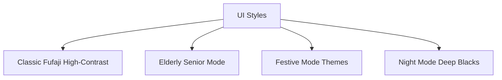
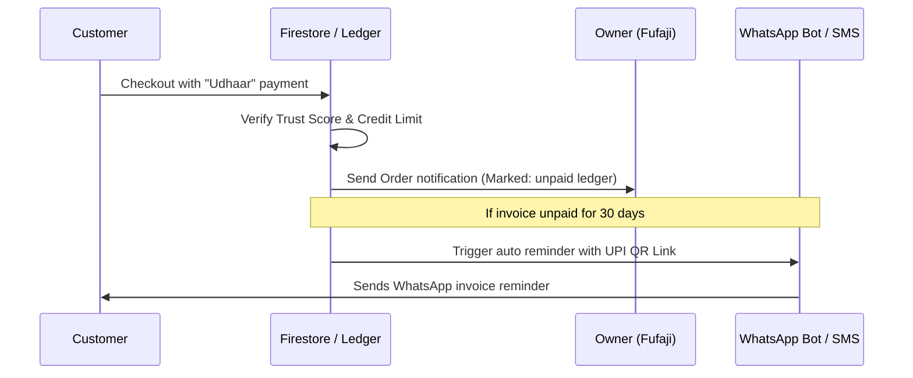

# 🏪 Fufaji's Online: The Ultimate Hyperlocal E-Commerce Ecosystem Blueprint

> **"Your Trusted Family Shop, Now Online."**  
> A detailed, production-ready system specification, database schema, branding guide, and workflow manual for building a local relationship-driven e-commerce platform.

---

## 📌 Executive Summary & Brand Strategy

Unlike generic e-commerce applications (Amazon, Blinkit, or Zepto) that operate on high-density urban logic, transactional interactions, and heavy discounts, **Fufaji's Online** is designed around **trust, familiarity, local relationships, and operational automation**.

### 1. Brand Positioning

- **Branding Theme**: Modern Hyperlocal Trust.
- **Primary Tone**: Friendly, reliable, traditional yet state-of-the-art.
- **Branding Palette**:
  - _Primary_: Warm Sunset Orange (`#FF6F00`) - Represents warmth, local energy, and accessibility.
  - _Secondary_: Deep Basil Green (`#2E7D32`) - Used for organic farm-fresh items, delivery tracking, and success indicators.
  - _Neutral Core_: Cream/Sand (`#FAECE3` / `#1A110B` in dark mode) - Avoids sterile cold whites; feels organic and close to the earth.
- **Branding Slogans**:
  - _"Fufaji's Online: Aapki Apni Dukaan"_ (Your own shop)
  - _"Fixed Price, Pure Quality, Family Trust"_

### 2. Strategic Advantages

1.  **Relation-First (Udhaar System)**: Hyperlocal commerce thrives on monthly credit ledgers. Digitizing the ledger ("Bahi-Khata") secures user loyalty.
2.  **Voice & Accessibility**: Designed for rural and elderly demographics who struggle with typing. Complete app functionality accessible via spoken Hindi, English, and regional dialects.
3.  **Owner-Free Operations**: Fufaji (the shop owner) does not need to look at Excel sheets or complex admin pages. The system uses AI to proactively alert, predict, and auto-generate supply orders.

---

## 🎨 UI/UX Design System & Accessibility

The user interface is designed to wow users at first glance with **glassmorphism, vibrant colors, and smooth micro-animations**, while remaining extremely accessible.



### 1. Theme Configurations

- **Classic Fufaji (Default)**: Modern card components with frosted glass effects (glassmorphism), subtle box shadows, and smooth transitions (using Framer Motion on Web, Hero Animations in Flutter).
- **Senior Mode**: Large, high-contrast buttons, simplified grid structures (single-column item view), Hindi/English labels, and persistent voice-activation bubbles.
- **Festive Mode**: Dynamically changes UI skins on Indian holidays (Gold/Red for Diwali, Green/White for Eid, Saffron/White for Independence Day) and highlights custom gift hampers.

### 2. Micro-interactions

- **Flying Cart Effect**: Adding a product executes a smooth parabolic translation of the product thumbnail into the shopping cart icon with haptic feedback.
- **Countdown Stepper**: Lightning deals feature pulse animations and real-time ticking progress bars.
- **Shimmer Loaders**: Clean gradient shimmers occupy cards during lazy database fetches to reduce perceived wait times.

---

## 👥 User Roles & Portals

The platform supports **five distinct user roles** with customized portals, all running from a unified app codebase (routed via role schemas in Firestore/Auth) or dedicated web dashboards.

```
                  ┌──────────────────────────────────────────────┐
                  │                 SUPER ADMIN                  │
                  └──────────────────────┬───────────────────────┘
                                         │ Manage Stores, Commissions, System Security
                                         ▼
                  ┌──────────────────────────────────────────────┐
                  │              SHOP OWNER (FUFAJI)             │
                  └───────┬──────────────────────────────┬───────┘
                          │                              │
        Assigns Orders    │                              │  Inventory Alerts
                          ▼                              ▼
┌──────────────────────────────┐                ┌──────────────────────────────┐
│        DELIVERY AGENT        │                │      EMPLOYEE / PACKER       │
└──────────────────────────────┘                └──────────────────────────────┘
Route navigation, OTP handovers                 Split packing terminal, barcode scans
                          ▲                              ▲
                          └──────────────┬───────────────┘
                                         │ Fulfills order
                                         │
                                         │ Place orders, Udhaar credit
                                  ┌──────┴──────┐
                                  │  CUSTOMER   │
                                  └─────────────┘
```

### 1. Customer

- **Onboarding**: 1-Tap OTP login, automatic GPS detection of village/district, landmark selection, and profile creation.
- **Discovery**: Multilingual voice search, Barcode scanner catalog lookup, Snap-to-Shop visual camera search, and hyperlocal farm transparency map links.
- **Cart & Checkout**: Unit selector, dynamic combinations, Razorpay gateway, Cash on Delivery, or "Add to Udhaar" digital ledger credit.
- **Post-Order**: Color-coded live GPS order tracking, Voice Address landmark playback, and driver rating/tipping collector.

### 2. Shop Owner (Fufaji)

- **Inventory Automation**: 5-Second Voice Seeding (e.g. _"Add 10kg apples at ₹120"_), background removal for item images, and WhatsApp bot document/bill parsing.
- **Operations**: Competitor price checking and dynamic auto-adjust pricing engine, distributor procurement auto-PO, and employee attendance logs.
- **Analytics**: FL Charts graphs for Sales, Profit/Loss, Cash Flow, and custom customer retention alerts (e.g., "Win-back" dormant users).

### 3. Employee / Packer

- **Dashboard**: Displays checklist of received orders sorted by delivery slot.
- **Fulfillment**: Large product checkoff photos, out-of-stock smart item replacement options, weight verification, and Bluetooth printing of shipping labels.

### 4. Delivery Agent

- **Interface**: Mobile dashboard displaying assigned delivery drops.
- **Navigation**: Multi-stop path optimizer using Google Maps API.
- **Verification**: Secure 4-digit handover OTP or buyer QR code scans. Cash collector panel for COD and daily settlement tracking.

### 5. Super Admin

- Multi-store coordination, commission structures, advertisement banner managers, and fraud prevention controls.

---

## 🛠️ Complete Technology Stack

A state-of-the-art, fault-tolerant infrastructure built to support instant responsiveness and offline survival.

| Layer                  | Technology                          | Purpose                                                                         |
| :--------------------- | :---------------------------------- | :------------------------------------------------------------------------------ |
| **Mobile App**         | Flutter (Dart)                      | Cross-platform client app for Customers, Packers, and Delivery Riders.          |
| **Web Portal**         | Next.js (React + TypeScript)        | Premium Admin dashboard for Shop Owners and Super Admins.                       |
| **Styling**            | TailwindCSS + Framer Motion         | Fluid layouts, animations, and high-fidelity transitions.                       |
| **Primary Backend**    | Firebase (Auth, Firestore, Storage) | User management, image/media hosting, and real-time database syncing.           |
| **Relational Backend** | Supabase (PostgreSQL + Prisma)      | Analytical queries, complex ledger statements, and employee database.           |
| **Caching & Locks**    | Upstash Redis                       | Flash deals, fast search suggestions, API rate limiting, and transaction locks. |
| **OTA Updates**        | Shorebird                           | Over-the-air patches for Flutter app without waiting for App Store approvals.   |
| **Integrations**       | Razorpay SDK, WhatsApp Business API | Payment processing, automatic ledger deposits, and chatbot orders.              |
| **AI Layer**           | Gemini Pro & Gemini Flash           | Bill/List OCR extraction, voice note command translation, and recommendations.  |

---

## 🚀 Key Feature Specifications

### 1. Digital Gaon Bahi-Khata (Local Credit Ledger)

Digitizes the traditional rural ledger account.

- **Trust Score Algorithm**: Automatically calculated based on repayment history, order frequency, and verification statuses.
- **Checkout Workflow**: Eligible customers can choose "Udhaar" as their payment method. The system records the transaction under a relational ledger in Postgres.
- **Collections System**: Auto-generates structured WhatsApp payment reminders with a payment link (Razorpay UPI) sent directly to the customer.



### 2. WhatsApp Bot Catalog & Bill Sync

Allows shop inventory updates via WhatsApp messages.

- **Bill Scanner**: Owner snaps a photo of a wholesale invoice and sends it to the Fufaji Business WhatsApp number.
- **Processing**: A webhook sends the image to a Firebase Cloud Function. The function calls Gemini Flash API with custom JSON schema structures:
  ```json
  {
    "items": [
      {
        "name": "Sugar",
        "quantity": 100,
        "unit": "kg",
        "purchasePrice": 38,
        "suggestedSalePrice": 44
      }
    ]
  }
  ```
- **Update**: The script automatically creates or increments inventory entries in Firestore and replies to Fufaji confirming the database is updated.

### 3. Competitor-Aware Dynamic Pricing Engine

Ensures Fufaji remains the most competitive vendor in the market.

- **Scraping & Inputs**: Connects with local market price APIs or accepts manual competitor rate updates.
- **Calculation**: Checks margins and updates the price sheet based on custom strategies (e.g., _"Beat Competitor X by ₹2 on staples, keeping margin above 5%"_).
- **Approve Workflow**: Fufaji receives a push notification: _"Competitor reduced Sugar to ₹42. Drop your price to ₹41? [Approve] [Reject]"_.

### 4. Zero-Friction Snap-to-Shop

Allows buyers to order groceries by taking a photo.

- **Camera Integration**: User captures a handwritten list or their kitchen cabinet.
- **AI Interpretation**: Gemini Vision API processes the image, extract items, runs semantic checks against the shop's active inventory catalog, and populates the cart automatically.

---

## 🗄️ Database Architecture (Prisma PostgreSQL Models)

This schema maps the relational transactions, ledger, and employee data, which mirrors and syncs with the real-time Firebase collections.

```prisma
datasource db {
  provider = "postgresql"
  url      = env("DATABASE_URL")
}

generator client {
  provider = "prisma-client-js"
}

enum Role {
  CUSTOMER
  OWNER
  PACKER
  DELIVERY_AGENT
  SUPER_ADMIN
}

enum OrderStatus {
  RECEIVED
  PACKING
  OUT_FOR_DELIVERY
  DELIVERED
  CANCELLED
}

enum PaymentMethod {
  COD
  RAZORPAY
  WALLET
  UDHAAR
}

model User {
  id              String       @id @default(uuid())
  phone           String       @unique
  name            String
  email           String?
  role            Role         @default(CUSTOMER)
  trustScore      Int          @default(100)
  creditLimit     Decimal      @default(5000.00)
  walletBalance   Decimal      @default(0.00)
  createdAt       DateTime     @default(now())
  updatedAt       DateTime     @updatedAt
  addresses       Address[]
  orders          Order[]      @relation("CustomerOrders")
  assignedOrders  Order[]      @relation("RiderOrders")
  ledger          BahiKhata[]
}

model Address {
  id         String   @id @default(uuid())
  userId     String
  user       User     @relation(fields: [userId], references: [id])
  type       String   // HOME, WORK, OTHER
  landmark   String
  voiceTagUrl String? // Firebase Storage path to audio landmarks
  latitude   Float
  longitude  Float
}

model Product {
  id              String         @id @default(uuid())
  barcode         String?        @unique
  name            String
  category        String
  purchasePrice   Decimal
  salePrice       Decimal
  stockQuantity   Decimal
  unit            String         // KG, LITER, PACKET, GM
  expiryDate      DateTime?
  sourceLocation  String?        // Coordinates or details of sourcing farm
  createdAt       DateTime       @default(now())
  orderItems      OrderItem[]
}

model Order {
  id              String       @id @default(uuid())
  customerId      String
  customer        User         @relation("CustomerOrders", fields: [customerId], references: [id])
  riderId         String?
  rider           User?        @relation("RiderOrders", fields: [riderId], references: [id])
  status          OrderStatus  @default(RECEIVED)
  paymentMethod   PaymentMethod
  totalAmount     Decimal
  otpCode         String       // Delivery confirmation OTP
  createdAt       DateTime     @default(now())
  items           OrderItem[]
  ledgerEntry     BahiKhata?
}

model OrderItem {
  id         String   @id @default(uuid())
  orderId    String
  order      Order    @relation(fields: [orderId], references: [id])
  productId  String
  product    Product  @relation(fields: [productId], references: [id])
  quantity   Decimal
  unit       String
  price      Decimal
}

model BahiKhata {
  id          String   @id @default(uuid())
  userId      String
  user        User     @relation(fields: [userId], references: [id])
  orderId     String?  @unique
  order       Order?   @relation(fields: [orderId], references: [id])
  amount      Decimal
  isSettled   Boolean  @default(false)
  dueDate     DateTime
  settledAt   DateTime?
  createdAt   DateTime @default(now())
}
```

---

## 🔒 Security & Anti-Fraud Architecture

1.  **Idempotent Transactions**: The Upstash Redis layer acts as a transaction locker, preventing duplicate submissions, duplicate wallet balances, or double refunds by locking `transaction_id` states for 5 seconds during execution.
2.  **Number Masking**: Delivery riders see client names and landmark information but call them using a Twilio proxy phone mask to secure user privacy.
3.  **Strict Firebase Rules**: Firestore document read/write structures require user IDs to match auth states, and ensure that only user roles of `OWNER` can edit product inventory and financial parameters.
4.  **Delivery Verification Loops**: Order transitions to `DELIVERED` only succeed if the rider inputs the correct 4-digit code generated dynamically in the customer's app, verifying physical delivery handovers.

---

## 📈 50-Point Implementation checklist (The Roadmap)

_Give this list to the AI to track development sequentially._

### Phase 1: Entry, Identity & Role Routing

- [ ] **1. SplashScreen Update Checking**: Background checks for new build releases on GitHub and initiates hot caching.
- [ ] **2. Role persistence routing**: Save role selection locally and in Firestore to route user roles instantly.
- [ ] **3. Firebase Phone Auth**: Login using phone verification with reCAPTCHA configuration.
- [ ] **4. Geolocation profile seeding**: Saves location coordinates and default districts to profile records.
- [ ] **5. Dynamic System Warmup**: Requests user permissions for location, alerts, and loads initial state assets.

### Phase 2: Product Discovery & AI Search (Customer)

- [ ] **6. Dual-Language Voice Search**: Connects speech inputs (Hindi/English) to product text tags.
- [ ] **7. Barcode Catalog Scan**: Allows user scanning of package barcodes to match and open shop listings.
- [ ] **8. Visual Snap-to-Shop**: Image parser mapping kitchen/bill photos to cart contents.
- [ ] **9. Lightning Deal Timers**: Shows active timers and stock bars for timed discounts.
- [ ] **10. Shimmer Grids**: Adds smooth placeholders during search load stages.
- [ ] **11. Local Farm Mapping**: Coordinates link cards to source farms.
- [ ] **12. Product Q&A Channels**: Enables public questions and owner response dialogs on item cards.
- [ ] **13. Multi-unit pricing schemas**: Supports selecting gram, kilo, and custom packet variants.

### Phase 3: Selection & Cart (Customer)

- [ ] **14. Media Product Reviews**: Enables video and image feedback attachments on reviews.
- [ ] **15. One-Click Quick Reorder**: Dynamic home widget containing user's usual staples.
- [ ] **16. Local cart persistence**: Saves cart states locally to recover configurations if the app restarts.
- [ ] **17. Hyperlocal Group Buying**: Shares cart codes to neighbors for joint checkouts.

### Phase 4: Checkout & Payment (Customer)

- [ ] **18. Voice Landmark Tags**: Saves audio guidelines to coordinate driver navigation.
- [ ] **19. Dynamic Delivery Type**: Choose express, standard, or pickup schedules with dynamic fees.
- [ ] **20. Smart Coupon Resolver**: Compares active coupons to apply maximum discounts.
- [ ] **21. Digital Fufaji Wallet**: Tracks internal user currency balances.
- [ ] **22. Gateway Integration**: Razorpay setup with callbacks, signatures, and UPI intents.

### Phase 5: Shopkeeper Automation (Owner)

- [ ] **23. Voice product seeding**: Populates add-product forms from raw owner speech.
- [ ] **24. Image background enhancer**: Automatically cleans backgrounds to studio white.
- [ ] **25. WhatsApp Bot OCR**: Updates database listings directly from WhatsApp bill uploads.
- [ ] **26. Moving-average low stock alerts**: Flags product listings near out-of-stock thresholds.
- [ ] **27. Expiry markdown Cron**: Decreases prices of fresh items automatically as they near expiry.
- [ ] **28. Scraper price adjuster**: Suggestions to match local competitor price trends.
- [ ] **29. Auto distributor PO creator**: Emails supplier ordering PDFs if stock matches thresholds.
- [ ] **30. CSV inventory importing**: Standardizes bulk updates from sheets.

### Phase 6: Order Fulfillment (Owner & Delivery)

- [ ] **31. Bluetooth print terminal**: Prints invoice tickets directly from packer views.
- [ ] **32. Out-of-Stock replace engine**: Suggests packers alternative items to swap for missing stock.
- [ ] **33. Multi-stop path optimizer**: Maps delivery drops in optimized order via Directions API.
- [ ] **34. Live GPS tracking stream**: Pushes rider coordinate points to customer maps.
- [ ] **35. Handover OTP locks**: Restricts delivery updates until customers confirm handovers via OTP.
- [ ] **36. WhatsApp status updates**: Automatically fires confirmations to client chats.

### Phase 7: CRM, Analytics & Growth (Owner)

- [ ] **37. Interactive P&L Dashboard**: Displays cash flow summaries via clean charts.
- [ ] **38. Dormant user discount CRM**: Sends coupons to users with no recent order history.
- [ ] **39. Combined product affinity suggestions**: Identifies products often bought in combinations to package deals.
- [ ] **40. Broadcast campaign manager**: Design banners and coordinate targeted alert distributions.
- [ ] **41. Loyalty tier thresholds**: Configures custom point collection mechanisms.
- [ ] **42. WhatsApp AI order loader**: Populates checkout fields from user chat messages.

### Phase 8: Resiliency & Security (System)

- [ ] **43. Offline SQLite mode**: Logs physical transactions while offline and syncs back when connections return.
- [ ] **44. Idempotency lockers**: Integrates Upstash Redis transactional checks.
- [ ] **45. Twilio masked calls**: Bridges drivers and users without exposing mobile numbers.
- [ ] **46. File storage secure vaulting**: Restricts invoice PDF access rules to verified owners and buyers.
- [ ] **47. System status overlays**: Gracefully holds screen actions if connections go down.

### Phase 9: Production Polish

- [ ] **48. Algolia typo search**: Enhances text lookups with typo-tolerant search suggestions.
- [ ] **49. Hero transitions**: Sets visual routes between details and listings.
- [ ] **50. Shorebird pipeline**: Setup actions for instant over-the-air patches.

---

## 🛠️ Step-by-Step AI Instructions

_"Copy this block to start building the app immediately."_

> "Please construct the hyperlocal shop application outlined above. Begin by initializing a unified codebase containing the Flutter mobile layouts (routed via GoRouter role states). Write the database migrations using Prisma pointing to a Postgres database, mirroring fields in Firestore collections. Set up security rules limiting document reads to matching customer ids, and edits to owner roles. Wire Razorpay webhooks for payment completions, implement speech transcription nodes to extract text parameters, and set up Redis locks verifying payment idempotence. Ensure all screens are mobile-first, and styled using modern glassmorphic theme cards with smooth loading shimmers."
