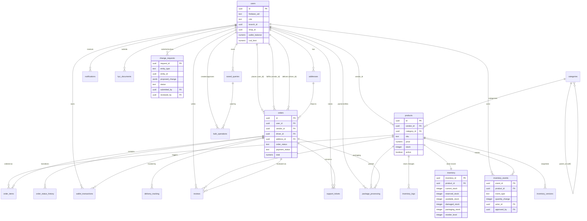

# Postgres (Supabase) Schema Reference

This is the schema for the "master" business database (Supabase/PostgreSQL),
built up across `supabase/migrations/001_core_schema.sql` through
`006_phase13_inventory_architecture.sql`. Firestore remains the system of
record for realtime/offline features (chat, live tracking, push
notifications); Postgres is the analytical and transactional source of truth
for catalog, orders, finance, and inventory, written via dual-write from the
Flutter app / Cloud Functions and backfilled historically by
`scripts/migration/migrate.js`.

## Entity-Relationship Diagram

## Table Reference

### Core business tables (Migration 001)

- **users** — mirrors Firebase Auth users + app profile/role data.
  `role` is constrained to `customer, employee, rider, dispatcher,
  branchManager, owner, superAdmin` (note: `supplier` and `franchiseOwner`
  from `RBACService`/`UserRole` are application-level roles layered on top —
  see [docs/RBAC.md](RBAC.md) for the full role list and how they map to
  permissions). Holds `wallet_balance`, `cod_limit`, `loyalty_points`,
  `referral_code`.
- **addresses** — customer delivery addresses, one-to-many from `users`,
  with `is_default` flag and lat/long for geolocation.
- **categories** — product category tree via self-referencing `parent_id`.
  Bilingual (`name`, `name_hi`).
- **products** — catalog master. Linked to `vendor_id` (users) and
  `category_id` (categories). `firestore_id` provides idempotent
  upsert key for migration. `status` constrained to
  `active, inactive, out_of_stock, discontinued`. Extended in Migration 006
  with `brand`, `tax_code`, `active`, and `unit_type` (renamed from `unit`).
- **orders** — order header: customer (`user_id`), vendor, driver, address,
  branch/shop scoping, `order_status` and `payment_status` state machines,
  monetary breakdown (`subtotal`, `discount`, `delivery_fee`, `tax`,
  `total`), coupon code, cancellation reason.
- **order_items** — line items per order, snapshot of `product_name`/
  `unit_price` at time of order.
- **order_status_history** — append-only audit trail of every
  `order_status` transition, written by the order workflow engine
  (`from_status` → `to_status`, `changed_by`, `reason`).
- **wallet_transactions** — ledger of wallet credits/debits.
  `type` constrained to `credit, debit, referralBonus, refund, adjustment,
  topup`, with running `balance_after`.
- **delivery_tracking** — per-order delivery state machine
  (`assigned → accepted → arrived_pickup → picked_up → arrived_dropoff →
  delivered/failed/cancelled`), with GPS coordinates and proof-of-delivery
  image.
- **reviews** — product reviews tied to `product_id`, `user_id`, optional
  `order_id` (for verified-purchase badge), 1-5 `rating`, optional images.
- **notifications** — per-user notification feed (`title`, `body`, `type`,
  `data` jsonb, `is_read`).
- **support_tickets** — customer support tickets with `status`
  (`open, in_progress, resolved, closed`) and `priority`
  (`low, normal, high, urgent`), assignable to staff (`assigned_to`).
- **coupons** — promo codes: `discount_type` (`percentage`/`flat`),
  `discount_value`, `min_order_value`, `max_discount`, usage limits
  (global `usage_limit`/`usage_count` and `per_user_limit`), validity window.
- **inventory_logs** — legacy stock-change ledger (`restock, sale,
  adjustment, return, damage`) — superseded for new writes by
  `inventory_events` (Migration 006) but retained for historical data.
- **audit_logs** — dual-written (Supabase + Firestore) system-wide audit
  trail: actor, action, target, before/after values (`old_value`/
  `new_value` jsonb), IP/device info.
- **kyc_documents** — vendor/rider KYC document submissions
  (`aadhaar, pan, gst, license, shop_proof, bank_proof, other`) with
  `pending/verified/rejected` review status.

All tables above with an `updated_at` column get it auto-maintained via the
shared `set_updated_at()` trigger function.

### Analytics materialized views (Migration 004)

Refreshed on a schedule via `refresh_fufaji_analytics()` (Cloud Scheduler /
pg_cron) — see task #83. Do not query these for real-time data; they reflect
the last refresh.

- **sales_analytics** — daily revenue/order rollups per `shop_id` /
  `vendor_id`: `order_count`, `delivered_count`, `cancelled_count`,
  `revenue`, `avg_order_value`.
- **vendor_analytics** — lifetime per-vendor performance: order counts,
  `total_revenue`, `avg_rating`, `review_count`, `last_order_at`.
- **delivery_analytics** — per-driver, per-day delivery performance:
  assigned/delivered/cancelled counts and `avg_delivery_minutes`.

Backing repository: `PostgresAnalyticsRepository` (task #24), surfaced in the
owner Postgres Analytics screen (task #25), gated by
`/owner/analytics/postgres` (see [docs/RBAC.md](RBAC.md)).

### Migration compatibility (Migration 005)

- Adds nullable, unique `firestore_id` columns to every remaining table the
  Firestore→Postgres backfill script touches (categories, addresses,
  order_items, order_status_history, wallet_transactions,
  delivery_tracking, reviews, notifications, support_tickets, coupons,
  inventory_logs, kyc_documents), enabling idempotent
  `ON CONFLICT (firestore_id) DO UPDATE` upserts.
- **migration_runs** — bookkeeping table: one row per collection per
  backfill run (`status`, `documents_seen/written/skipped`, `last_doc_id`,
  `error`, timestamps), so the backfill can resume safely. See
  `docs/MIGRATION_RUNBOOK.md` (task #29) for operational details.

### Phase 13 intelligent inventory & approval architecture (Migration 006)

This is the schema backing the Excel-like bulk inventory query/update system
and the owner-approval workflow from tasks #116-122.

- **inventory** — dedicated stock record per `product_id` (+ optional
  `warehouse_id`), separating stock from `products`. `available_stock` is a
  generated column (`current_stock - reserved_stock - damaged_stock`).
  Tracks `packaging_stock` and `reorder_level`.
- **package_processing** — per-order, per-product packaging pipeline
  (`pending → picking → packed → verified → shipped`), tracking
  `packed_quantity`/`damaged_quantity` and who packed/verified. This is the
  hook that auto-syncs stock when an item is processed for parcel/packaging
  (task #119, `OrderWorkflowEngine`).
- **inventory_events** — append-only event ledger; stock is never written
  directly — every change is an event (`ORDER_CREATED, ORDER_CANCELLED,
  ITEM_PACKED, ITEM_DAMAGED, RETURN_RECEIVED, STOCK_ADDED, STOCK_REMOVED`)
  with `quantity_change`, `old_value`/`new_value`, `actor_id`/`actor_role`,
  and `approved_by`.
- **change_requests** — the owner-approval queue referred to elsewhere as
  "inventory_change_requests" (the application-level model is
  `inventory_change_request_model.dart`, task #116). Generic
  `entity_type`/`entity_id` + `proposed_change` jsonb, with
  `pending/approved/rejected` status, `submitted_by`/`reviewed_by`,
  `approval_notes`. **All bulk inventory writes must flow through this
  table and `InventoryChangeRequestService.approveRequest()`** — never
  write bulk changes directly to `products`/`inventory`.
- **saved_queries** — owner-saved Excel-like filter definitions
  (`filter_json`), used by `InventoryQueryService` (task #117) to build the
  Bulk Inventory Query Builder screen (task #120).
- **bulk_operations** — a bulk write derived from a `saved_queries` filter:
  `operation_type`, `operation_data`, `created_by`, `approved_by`,
  `executed_at`. Pairs with `change_requests` for the approval gate.
- **inventory_versions** — point-in-time JSON snapshots of a product's
  inventory state (`snapshot_json`), for rollback/audit of bulk operations.
- **automation_rules** — condition/action rule definitions
  (`condition_json`, `action_json`, `enabled`) for the automation/workflow
  rules engine (task #84).

## Indexes & RLS

See `002_indexes.sql` for performance indexes and `003_rls_policies.sql` for
row-level security policies enforced per role. Any new table added to this
schema should get: an `updated_at` trigger (if mutable), appropriate indexes
on foreign keys and frequently-filtered columns, and an RLS policy
consistent with the role's permissions in [docs/RBAC.md](RBAC.md).
