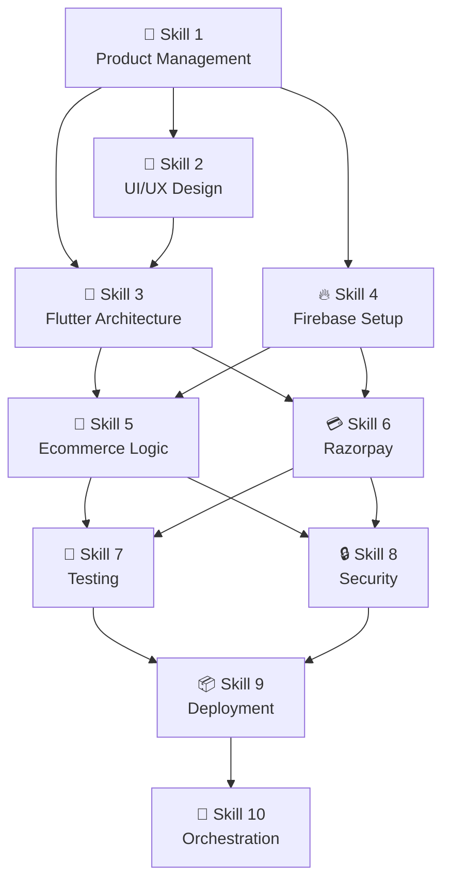

# 🎬 Fufaji Online — AI Team Build Orchestration Guide
> Run all 10 skills in the right order to build the complete app

---

## Skill Dependency Graph

---

## Execution Order

| Step | Skill | Can run with | Output file |
|------|-------|-------------|-------------|
| 1 | Product Management | — | `outputs/skill-1/PRD.md` |
| 2 | UI/UX Design | Skill 3 | `outputs/skill-2/design_tokens.dart` |
| 3 | Flutter Architecture | Skill 2 | `outputs/skill-3/pubspec.yaml` |
| 4 | Firebase Setup | After Skill 1 | `outputs/skill-4/firestore.rules` |
| 5 | Ecommerce Logic | After 3+4 | `outputs/skill-5/cart_provider.dart` |
| 6 | Razorpay | After 3+4 | `outputs/skill-6/razorpay_service.dart` |
| 7 | Testing | After 5+6 | `outputs/skill-7/ci.yml` |
| 8 | Security | After 5+6 | `outputs/skill-8/SECURITY.md` |
| 9 | Deployment | After 7+8 | `outputs/skill-9/release.yml` |
| 10 | Orchestration | Final | `outputs/skill-10/README.md` |

---

## Parallel Execution (save time)

**Wave 1:** Skill 1 alone  
**Wave 2:** Skills 2 + 3 (parallel)  
**Wave 3:** Skill 4 (needs Wave 1)  
**Wave 4:** Skills 5 + 6 (parallel, needs Waves 2+3)  
**Wave 5:** Skills 7 + 8 (parallel, needs Wave 4)  
**Wave 6:** Skill 9 (needs Wave 5)  
**Wave 7:** Skill 10 (final)

---

## Validation Checklist (before moving to next skill)

### After Skill 1:
- [ ] User stories have Given/When/Then format
- [ ] All 5 roles covered in MoSCoW
- [ ] Technical requirements reference Flutter + Firebase

### After Skill 2:
- [ ] Design tokens are valid Dart constants
- [ ] Color contrast ≥ 4.5:1
- [ ] Hindi strings included

### After Skill 3:
- [ ] `flutter pub get` runs without errors
- [ ] All packages are null-safe
- [ ] GoRouter navigation compiles

### After Skill 4:
- [ ] Firestore rules pass Rules Playground
- [ ] asia-south1 region selected
- [ ] Phone auth +91 enabled

### After Skill 5:
- [ ] GST calculation accurate by category
- [ ] Udhaar cannot exceed credit limit
- [ ] Cart persists on app restart (Hive)

### After Skill 6:
- [ ] Razorpay webhook verifies signature
- [ ] Test payment works with success@razorpay
- [ ] COD limit from Remote Config

### After Skill 7:
- [ ] CI runs on every PR
- [ ] Coverage ≥ 80% for domain layer
- [ ] All integration tests pass on Firebase Emulator

### After Skill 8:
- [ ] No hardcoded secrets in source
- [ ] Security rules block unauthorized writes
- [ ] Rate limiting active on OTP endpoint

### After Skill 9:
- [ ] APK < 30MB per ABI
- [ ] Signing works in CI
- [ ] Shorebird patch deployment tested

---

## Troubleshooting Top 10

| # | Problem | Fix |
|---|---------|-----|
| 1 | `flutter pub get` fails | Check Flutter version compatibility in pubspec.yaml |
| 2 | Firebase Auth not working | Verify SHA-1 fingerprint in Firebase console |
| 3 | Razorpay webhook failing | Check HMAC-SHA256 signature verification in Cloud Function |
| 4 | Firestore rules blocking owner | Ensure `request.auth.uid == resource.data.ownerId` |
| 5 | APK too large | Use `--split-per-abi`, enable ProGuard |
| 6 | Hindi text not rendering | Add Noto Sans to pubspec assets and GoogleFonts |
| 7 | OTP not received | Check Firebase Auth quotas and +91 allowlist |
| 8 | Hive box not found | Call `Hive.initFlutter()` before `runApp()` |
| 9 | CI build failing | Check Java version (needs Java 11+) and NDK version |
| 10 | Shorebird patch rejected | Ensure no native code changes (Dart-only patches) |

---

*Use this guide alongside `SKILL_MATRIX.md` and `AI_AGENT_TEAMS.md`* 🏪
